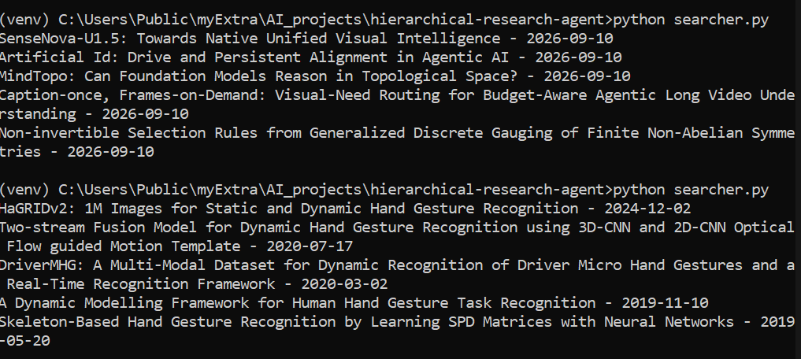
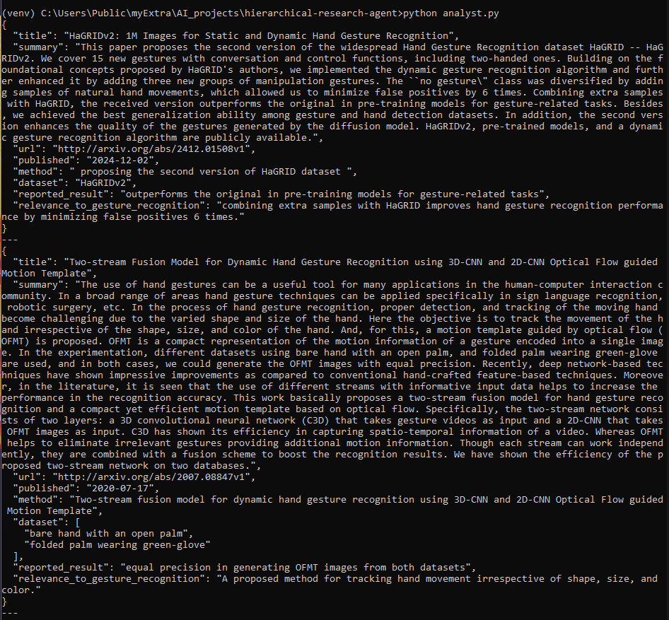
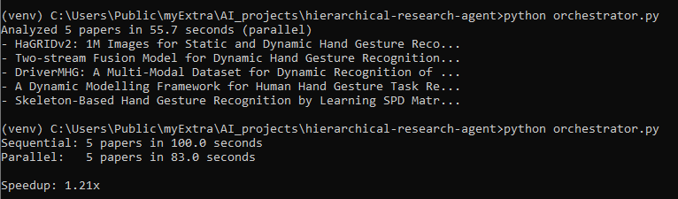
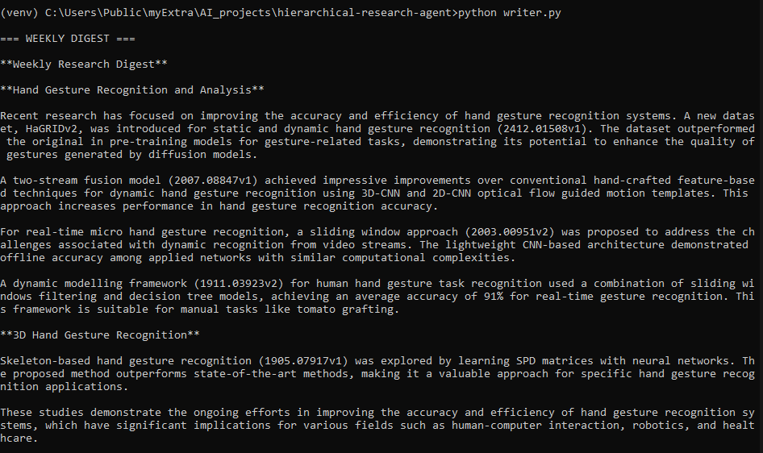

# hierarchical-research-agent

A small multi-agent pipeline that searches arXiv for papers on a topic, analyzes them in parallel, and writes a weekly digest out of them. Built this to learn hierarchical/parallel agent orchestration using a local LLM (Llama 3.2 3B via LM Studio).

## How it works

```
Searcher -> Analyst (runs in parallel for each paper) -> Writer
```

- `searcher.py` - searches arXiv for a topic and returns the top papers
- `analyst.py` - one agent that reads a paper and pulls out title, method, dataset, result, relevance
- `orchestrator.py` - runs the analyst on all papers at once (asyncio) instead of one at a time, and times both
- `writer.py` - takes all the analyzed papers and turns them into one readable digest (~400 words)

## Benchmark

Ran it on 5 papers about hand gesture recognition:

- Sequential: 100s
- Parallel: 83s
- Speedup: 1.21x

Not a huge speedup, and that's because LM Studio was only running with 4 parallel slots, so 5 requests can't fully parallelize on one local machine the way they would against a cloud API. Keeping this number as-is since it's the real result, not a made up one - this pattern would show a much bigger speedup against something like Claude or GPT with higher concurrency limits.

## Screenshots

Searcher pulling papers:



Analyst output (structured JSON per paper):



Orchestrator - parallel vs sequential:



Final digest from writer.py:



## Running it

Needs LM Studio running locally with `llama-3.2-3b-instruct` loaded on `http://localhost:1234/v1`.

```bash
python -m venv venv
venv\Scripts\activate
pip install openai requests

python searcher.py
python analyst.py
python orchestrator.py
python writer.py
```

`writer.py` runs the whole thing end to end and prints the digest.
